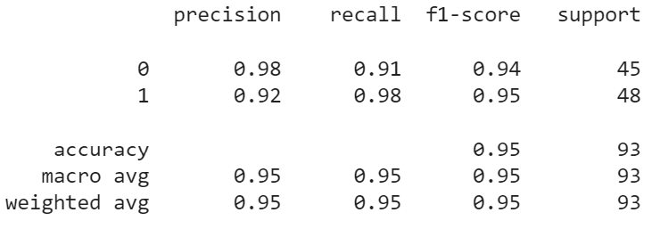
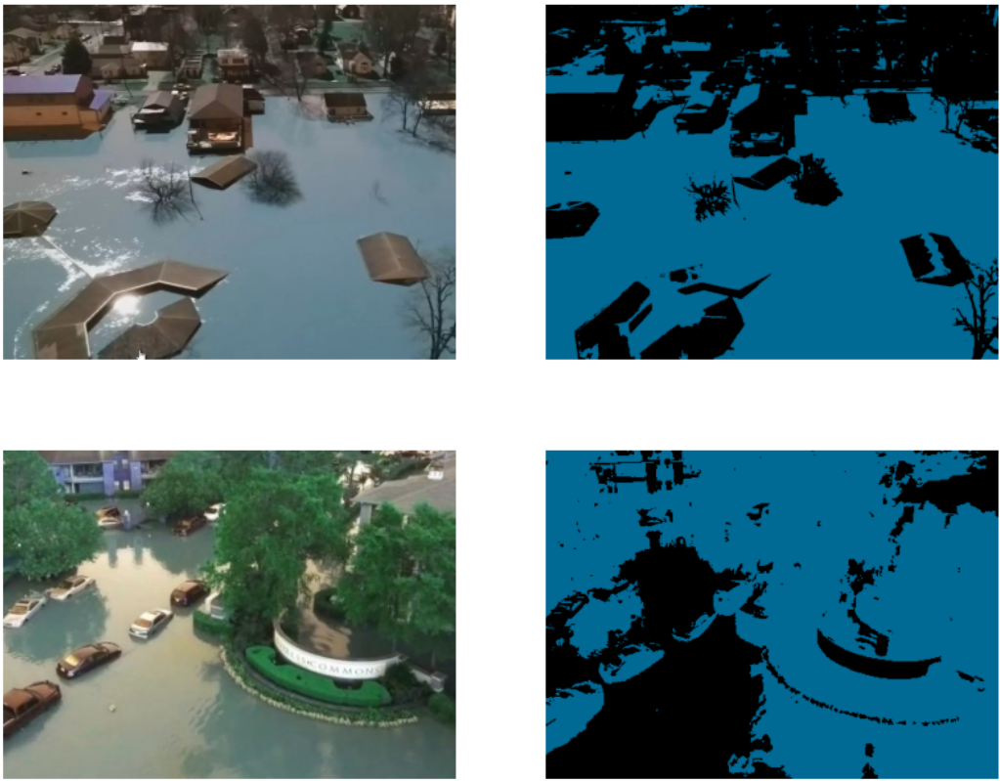

<h1 align="center">Flood-Detector</h1>

# Table of Contents
1. [Introduction to the Problem](#introduction-to-the-problem)
2. [Dataset Description](#dataset-description)
3. [Project Pipeline](#project-pipeline)
4. [Data Preprocessing](#data-preprocessing)
5. [Feature Engineering](#feature-engineering)
6. [Classical Machine Learning Models](#classical-machine-learning-models)
7. [Deep Learning Models](#deep-learning-models)
8. [Models' Comparison](#models-comparison)
9. [Per-pixel Classification (Unsupervised Clustering)](#per-pixel-classification-unsupervised-clustering)


# Introduction to the Problem
Floods are one of the most devastating natural disasters that affect millions of people worldwide every year. The ability to quickly and accurately assess the damage caused by floods is crucial for emergency responders. disaster relief organizations, and government agencies to plan and allocate resources effectively.

Satellite imagery provides a unique and powerful tool for post-flood damage assessment, as it can cover large areas and capture high-resolution images of the affected regions. However. manually analyzing these images is a time-consuming and labor-intensive process. making it challenging to provide timely and accurate assessments.

The goal of this project is to develop an automated method for detecting post-flood damages in satellite imagery using machine learning and computer vision techniques. The proposed solution will allow for the rapid and accurate identification of damaged areas, enabling emergency responders to quickly prioritize their response efforts and allocate resources more effectively. The proposed solution can also be used to monitor the long-term impact of floods on the affected areas, allowing for more informed decision-making and better disaster preparedness in the future.

In summary, the proposed solution has the potential to make a significant impact in disaster response and recovery efforts, ultimately improving the lives of people affected by floods. 


# Dataset Description
The dataset consists of 922 satellite (i.e remotely sensed) RGB images in which they are either classified as flooded or non-flooded images.

The distribution of the dataset is as shown in the following figures:


The resolution of images is not constant accross the dataset. The average resolution of the images is 1352x1794.


# Project Pipeline


# Data Preprocessing
The preprocessing pipeline for the classical machine learning models is as follows:
- Resize the image to the average resolution of the dataset (1352x1794)
- Filter the image using the following mask (according to description of the СORINE land cover project this 3x3 mask is recommended to use for edge enhancement for the remotely sensed image)

<p align="center">
  
</p>

The preprocessing for the deep learning models is done using one of the following techniques:
1. Using the following `transform` object:
```python
transform = transforms.Compose([
    transforms.Resize((256, 256)),
    transforms.RandomHorizontalFlip(),
    transforms.ToTensor(),
    transforms.Normalize((0.485, 0.456, 0.406), (0.229, 0.224, 0.225))
])
```
Which can be summarized as follows:
- Resize the image to have a width and height of 256 pixels. It maintains the aspect ratio of the original image while resizing it.
- Randomly flip the image horizontally with a 50% probability. It helps introduce variety and reduces overfitting by creating mirrored versions of the original images.
- Convert the image into a PyTorch tensor. PyTorch tensors are multi-dimensional arrays that can be efficiently processed on GPUs and are the standard input format for most deep learning models.
- Normalize the image tensor by subtracting the mean and dividing by the standard deviation. The provided mean and standard deviation values are the channel-wise means and standard deviations calculated from the ImageNet dataset. Normalization helps in improving model training by making the input data have zero mean and unit variance.

2. Using the following `transform` object:
```python
transform = transforms.Compose([
    transforms.RandomResizedCrop(64, scale=(0.8, 1.0)),
    transforms.RandomHorizontalFlip(),
    transforms.ToTensor(),
    transforms.Normalize(mean=[0.485, 0.456, 0.406], std=[0.229, 0.224, 0.225])
])
```
Which can be summarized as follows:
- Randomly crop and resize the image to a size of 64x64 pixels. The crop is randomly sampled from the input image, and the scale parameter controls the range of the resizing. In this case, the scale range is set from 0.8 to 1.0, allowing the cropped region to have a size between 80% and 100% of the original image's size.
- Randomly flip the image horizontally with a 50% probability, just like in the previous example. It introduces diversity and prevents overfitting.
- Convert the image into a PyTorch tensor. PyTorch tensors are multi-dimensional arrays that can be efficiently processed on GPUs and are the standard input format for most deep learning models.
- Normalize the image tensor by subtracting the mean and dividing by the standard deviation. The provided mean and standard deviation values (0.485, 0.456, 0.406) and (0.229, 0.224, 0.225) respectively are the channel-wise means and standard deviations calculated from the ImageNet dataset. The normalization step helps to standardize the input data for better model training.

# Feature Engineering
The features used for the classical machine learning models are as follows:
- HOG feature: The HOG feature is calculated by dividing the preprocessed RGB image into cells, computing histograms of gradient orientations within each cell, and then concatenating these histograms to form the final feature vector. The HOG feature is commonly used in computer vision tasks, such as object detection and image classification, as it captures local shape and edge information within an image.
- GLCM features: The GLCM is constructed from a gray-scale image using specific distances and angles. There are various properties of the gray-level co-occurrence matrix.
    - Contrast: Measures the local variations in the gray-level co-occurrence matrix.
    - Dissimilarity: Measures the local differences in the gray-level co-occurrence matrix.
    - Energy: Measures the uniformity of the gray-level co-occurrence matrix.
    - Correlation: Measures the linear dependency of gray-level values in the co-occurrence matrix.

Each image is converted into a feature vector of 4228 features which is composed of the two described features above concatenated with each other. This feature vector is then used as the input for the classical machine learning models.

# Classical Machine Learning Models
A voting classifier composed of three machine learning models is implemented. The three models are as follows:
- XGBoost (eXtreme Gradient Boosting): A machine learning algorithm that belongs to the gradient boosting family. It is known for its high performance and effectiveness in various machine learning tasks, particularly in structured and tabular data problems. It uses a boosting technique, which is an ensemble learning method that combines multiple weak models (typically decision trees) to create a strong predictive model.
- Support Vector Machine (SVM): A supervised machine learning algorithm used for classification, regression, and outlier detection tasks. It is particularly effective in solving binary classification problems but can be extended to handle multi-class classification as well. The SVM classifier works by finding an optimal hyperplane that separates the data points of different classes in a high-dimensional feature space
- Random Forest Classifier: An ensemble machine learning algorithm used for classification and regression tasks. It is based on the concept of decision trees and combines the predictions of multiple individual decision trees to make a final prediction.

The final model is a voting classifier that combines the predictions of the three individual models using a majority vote. The voting classifier is implemented using the VotingClassifier class from the sklearn.ensemble module.

```python
model = VotingClassifier(
    estimators=[('xgb', xgb_classifier), ('rf', rf_classifier), ('svm', svm_classifier)],
    voting='soft'
)
```
The soft voting is specified, which means the classifiers' predicted probabilities are combined, and the class with the highest average probability across all classifiers is chosen as the final prediction.

### Model Evaluation:
The dataset is split into 80% training and 20% testing. The model is trained on the training set and evaluated on the testing set.


<hr>


# Deep Learning Models
1. Convolutional Neural Network (CNN): This model is implemented from scratch using pytorch. The summary of the model is shown in the following figure:

    

    Learning curves:

    

    

    Model evaluation (80% training, 10% validation, 10% testing):

    


<hr>

2. ResNet-50 (pre-trained model): It is a deep convolutional neural network architecture that was introduced by Microsoft Research in 2015. It is a variant of the ResNet architecture, which stands for "Residual Network," designed to address the challenges of training very deep neural networks. The ResNet-50 model is characterized by its depth and the use of residual connections. It consists of 50 layers, including convolutional layers, pooling layers, fully connected layers, and shortcut connections (residual connections). The residual connections allow for the smooth flow of gradients during training and help alleviate the vanishing gradient problem, enabling the training of very deep networks. This model is fine-tuned by replacing the last fully connected layer with a new one that outputs 2 classes instead of 1000 classes.

    ```python
    model = models.resnet50(pretrained=True)
    num_ftrs = model.fc.in_features
    model.fc = nn.Linear(num_ftrs, 2)
    ```
    Learning curves:

    

    

    Model evaluation (80% training, 10% validation, 10% testing):

    

<hr>

3. AlexNet (pre-trained model): AlexNet is a convolutional neural network architecture. It achieved remarkable performance in the ImageNet Large Scale Visual Recognition Challenge (ILSVRC) in 2012, demonstrating the power of deep convolutional neural networks for image classification tasks. This model is fine-tuned by replacing the existing last fully connected layer with a new linear layer that takes an input size of 4096 (the size of the previous layer's output) and outputs a size of 2. This modification is performed when fine-tuning a pre-trained model for a different task. By replacing the last fully connected layer, you effectively change the output dimension of the model, making it suitable for a binary classification task with 2 classes.

    ```python
    model = models.alexnet(pretrained=True)
    model.classifier[6] = nn.Linear(4096, 2)
    ```

    Learning curves:

    

    After smoothing the curve:

    


    Model evaluation (80% training, 10% validation, 10% testing):

    

<hr>

4. DenseNet-201 (pre-trained model): DenseNet is a convolutional neural network architecture that was introduced in 2016. It is characterized by its dense connections between layers, which are achieved by concatenating the feature maps of all preceding layers. This architecture has several advantages, including the efficient use of parameters and the smooth flow of gradients, which helps alleviate the vanishing gradient problem. This model is fine-tuned by replacing the last fully connected layer with a new one that outputs 2 classes.


    ```python
    model = models.densenet201(pretrained=True)
    num_ftrs = model.classifier.in_features
    model.classifier = nn.Linear(num_ftrs, 2)
    ```

    Learning curves:

    

    

    Model evaluation (80% training, 10% validation, 10% testing):

    


<hr>

# Models' Comparison

<table>
    <tr>
        <th>Model</th>
        <th>Accuracy</th>
        <th>Macro-average F1-score</th>
    </tr>
    <tr>
        <td>Voting Classifier (classical ML)</td>
        <td align="center">0.83</td>
        <td align="center">0.83</td>
    </tr>
    <tr>
        <td>CNN model</td>
        <td align="center">0.92</td>
        <td align="center">0.92</td>
    </tr>
    <tr>
        <td style="font-weight:bold">ResNet-50</td>
        <td align="center" style="font-weight:bold">0.98</td>
        <td align="center" style="font-weight:bold">0.98</td>
    </tr>
    <tr>
        <td>AlexNet</td>
        <td align="center">0.97</td>
        <td align="center">0.97</td>
    </tr>
    <tr>
        <td>DenseNet-201</td>
        <td align="center">0.95</td>
        <td align="center">0.95</td>
    </tr>
<table>


# Per-pixel Classification (Unsupervised Clustering)
The goal of this module is to color the flooded segments in the images with a color different from the other areas. Note that the blue color is not always used to map the flooded areas (i.e. the blue color may map to flooded and non-flooded segments and the black color may map to flooded and non-flooded segments).

1. K-means clustering:

    

    

    

    

    

    

    

    
    
2. ISODATA clustering:

    

    

    

